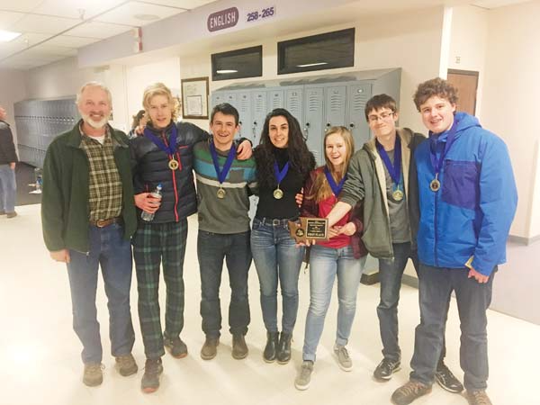
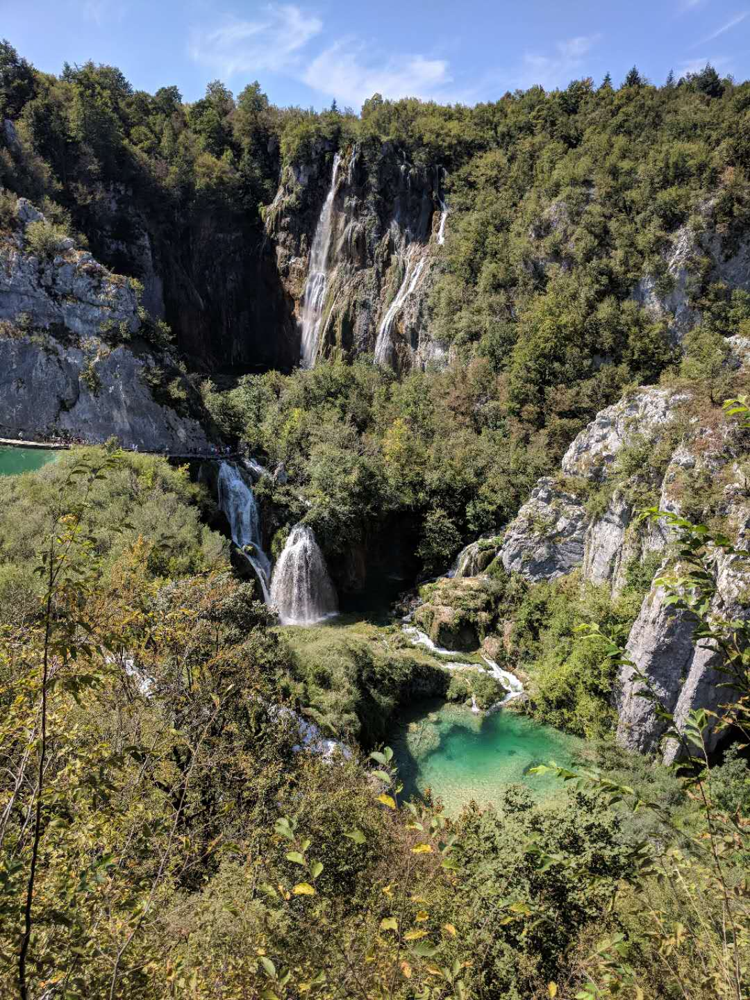

# Photos
*A visual representation of my escapades...*

Backcountry skiing up Powder Cache ridge in search of some fresh powder

Cooling off at a secluded waterfall in the Methow Valley, WA

Celebrating our regional Knowledge Bowl victory which was followed by a state championship

Exploring waterfalls at the stunning Plitvice Lakes National Park of Croatia

Zooming up to WA pass before HWY 20 re-opened
